# Vista de arquitectura

```mermaid
flowchart LR
  Partner[Partner / API] --> Command[Command handler]
  Command --> Domain[Work aggregate\nDomain model]
  Domain --> Repo[Repository port]
  Repo --> PG[(PostgreSQL)]
  Repo --> Outbox[(Outbox events)]
  Outbox --> Relay[Outbox relay]
  Relay --> Broker[Apache Pulsar\npublic/default/hda-work-created-v1]
  Broker --> Audit[Orchestration module\nEvent consumer]
  Broker --> AssignCommand[AssignProviderCommand.v1]
  AssignCommand --> Provider[Provider Assignment\nconsumer + CRUD]
  Provider --> ProviderEvent[ProviderAssigned.v1]
  ProviderEvent --> ApproveCommand[ApproveClaimCommand.v1]
  ApproveCommand --> Approval[Claim Approval\nconsumer + CRUD]
  Approval --> ApprovalEvent[ApprovalGranted.v1]
  ApprovalEvent --> PaymentCommand[AuthorizePaymentCommand.v1]
  PaymentCommand --> Payment[Payment Compensation\nconsumer + CRUD]
  Payment --> PaymentEvent[PaymentAuthorized.v1]
  Audit --> AuditDB[(PostgreSQL\nAudit projection)]
  Query[Query handler] --> Repo
```

El comando y la consulta entran por la interfaz HTTP, pero el dominio no depende de HTTP, PostgreSQL ni Pulsar. El módulo de orquestación solo conoce el contrato del evento; no importa la agregación de trabajo ni consulta sus tablas.

## Puntos de sensibilidad

- El pool, los índices y el particionamiento de PostgreSQL afectan escalabilidad.
- La transacción PostgreSQL + outbox afecta fiabilidad y no debe reemplazarse por dos escrituras independientes.
- El tópico y las particiones de Apache Pulsar afectan escalabilidad y orden de eventos.
- El contrato y la clave de idempotencia afectan la consistencia del módulo `orchestration`.
- La frontera entre dominio e infraestructura afecta modificabilidad y testabilidad.
